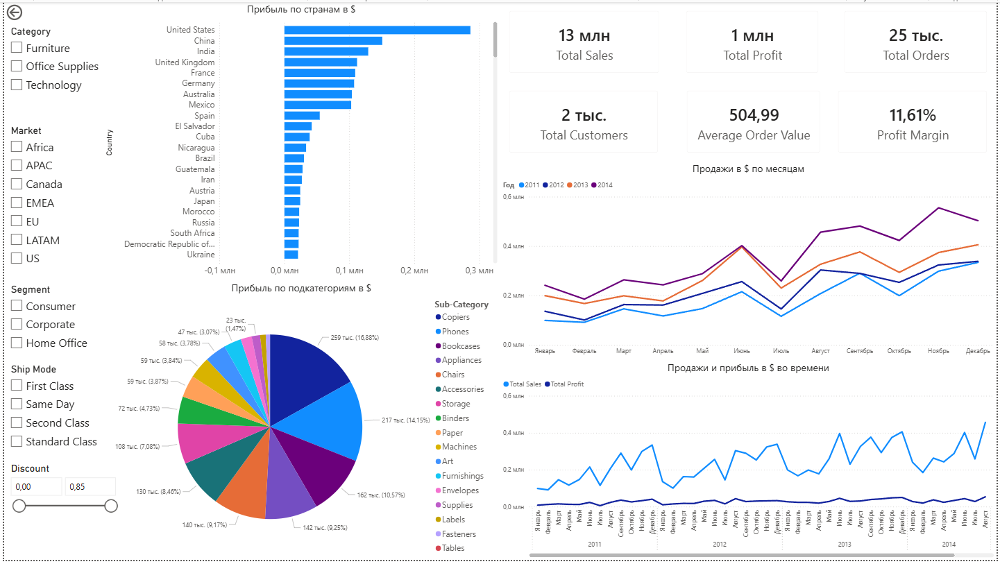
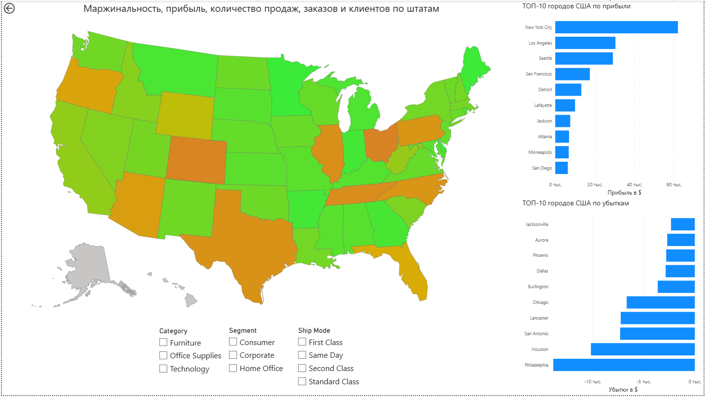
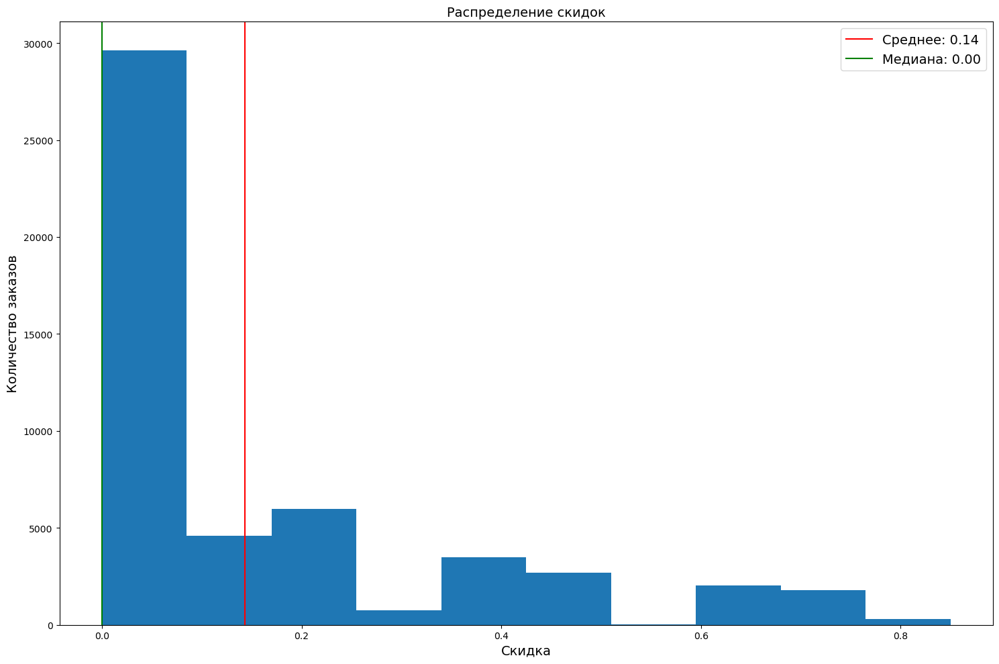
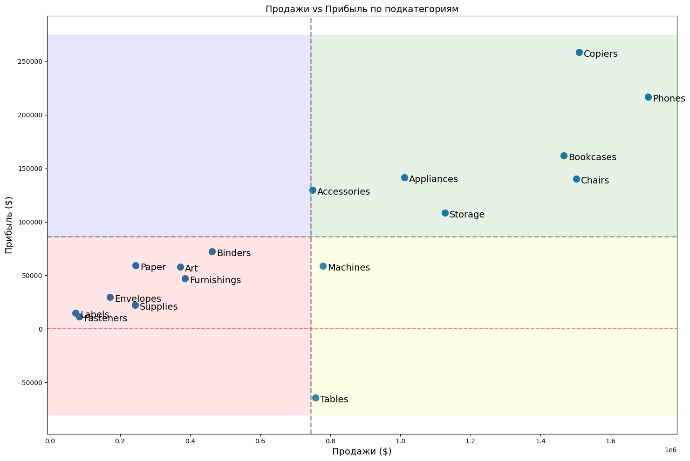

# Global Superstore Analytics Dashboard

Интерактивный дашборд в Power BI для анализа продаж, прибыли и эффективности бизнеса Global Superstore за 2011–2014 гг. Включает аналитические выводы, сделанные при EDA на Python.


## Содержание
- [О проекте](#о-проекте)
- [Скриншоты](#скриншоты)
- [Ключевые инсайты](#ключевые-инсайты)
- [Функциональность](#функциональность)
- [Стек технологий](#стек-технологий)
- [Установка и запуск](#установка-и-запуск)
- [Структура проекта](#структура-проекта)

## О проекте

Дашборд создан на основе датасета [Global Superstore](https://www.kaggle.com/datasets/shekpaul/global-superstore/data) с Kaggle. Цель проекта - продемонстрировать полный цикл аналитики: от исследования данных (EDA) в Jupyter до построения интерактивного дашборда в Power BI.

## Скриншоты

<div align="center">
  <table>
    <tr>
      <td align="center">
        
        <br/>
        <b>Общий вид дашборда</b>
      </td>
      <td align="center">
        
        <br/>
        <b>Анализ по категориям</b>
      </td>
      <td align="center">
        
        <br/>
        <b>Анализ скидок</b>
      </td>
    </tr>
    <tr>
      <td align="center">
        
        <br/>
        <b>Карта штатов США</b>
      </td>
      <td align="center">
        
        <br/>
        <b>Анализ убыточного штата</b>
      </td>
      <td align="center">
        
        <br/>
        <b>Анализ убыточной подкатегории</b>
      </td>
    </tr>
  </table>
</div>

## Ключевые инсайты

### Общие показатели
- **Общие продажи:** $12.64M
- **Общая прибыль:** $1.47M
- **Всего заказов:** 25,035
- **Уникальных клиентов:** 1,590
- **Средняя маржинальность:** 11.61%
- **Средний чек:** $504.99

### Наиболее прибыльные подкатегории и штаты
- **Technology** - самая маржинальная категория (13.99%)
- **Copiers** - лидер по прибыли ($258K)
- **Phones** - второе место по прибыли ($217K)
- **California, New York, Washington** - топ-3 штата по прибыли

<div align="center">
  <table>
    <tr>
      <td align="center">
        
        <br/>
        <b>Гистограмма распределения скидок</b>
      </td>
      <td align="center">
        
        <br/>
        <b>Матрица сгруппированных подкатегорий</b>
      </td>
    </tr>
  </table>
</div>

Интерпретация осей и линий

- Ось X - Продажи ($). Чем правее точка, тем больше выручка у подкатегории.
- Ось Y - Прибыль ($). Чем выше точка, тем больше прибыль.
- Вертикальная линия - средний уровень продаж по всем подкатегориям.
- Горизонтальная линия - средний уровень прибыли по всем подкатегориям.

Точки делятся на 4 квадранта:

| Квадрант | Характеристика                   | Стратегия                                 | Подкатегории |
|:--------:|:--------------------------------:|:-----------------------------------------:|:------------:|
| Зеленый  | Высокие продажи, высокая прибыль | Инвестировать, развивать                  | Copiers, Phones, Bookcases, Chairs, Storage, Appliances, Accessories |
| Синий    | Низкие продажи, высокая прибыль  | Анализировать, можно масштабировать       | Нет |
| Желтый   | Высокие продажи, низкая прибыль  | Сокращать затраты, повышать цены, уходить | Machines, Tables |
| Красный  | Низкие продажи, низкая прибыль   | Поддерживать, не вкладывать много         | Labels, Binders, Paper, Art, Furnishings, Envelopes, Supplies, Fasteners |

### Выявленные проблемы
- **30.12% заказов убыточны** (7,541 шт.), общий убыток $920K
- **Tables** - единственная убыточная подкатегория (-$64K)
- **10 штатов США** убыточны, наиболее убыточные: Texas, Ohio, Pennsylvania
- **Регионы APAC Southeast Asia, LATAM South, EMEA** имеют критически низкая маржинальность (2-5%)

### Статистический анализ
- **Корреляция Спирмена** между скидкой и прибылью равна **-0.596** (p-value < 0.0001)
- **Порог убыточности:** скидки до 20% безопасны, выше 20% - убыточны

## Функциональность

* Интерактивный дашборд с фильтрами по году, категории, сегменту, рынку
* Карточки KPI с ключевыми метриками
* Анализ продаж и прибыли по категориям и подкатегориям
* Географический анализ: детальная карта США по штатам
* Временной анализ: тренды по месяцам и годам

## Стек технологий

* **Визуализация:** Power BI Desktop
* **Анализ данных:** Python 3.10, pandas, numpy
* **Статистика:** scipy
* **Визуализация в Python:** matplotlib, seaborn
* **Среда:** Jupyter Notebook, conda

## Установка и запуск

1. Клонирование репозитория
```bash
git clone https://github.com/AlexanderSh11/powerbi-sales-dashboard-global-superstore.git
cd powerbi-sales-dashboard-global-superstore
```

2. Создание окружения conda
```bash
conda env create -f environment.yml
conda activate superstore-bi
```

3. Откройте файл dashboard.pbix. Обновите источники данных, если необходимо

4. Сохранение окружения
```bash
conda env export --from-history > environment.yml
```

## Структура проекта

powerbi-sales-dashboard-global-superstore/  
├── data/                         # Данные  
│   ├── raw/                      # Исходные данные с Kaggle  
│   └── processed/                # Обработанные данные для Power BI  
├── notebooks/                    # Jupyter Notebooks  
│   └── 01_eda_and_data_preparation.ipynb  
├── images/                       # Скриншоты дашборда и графиков  
├── environment.yml               # Зависимости conda  
├── .gitignore  
└── README.md  
